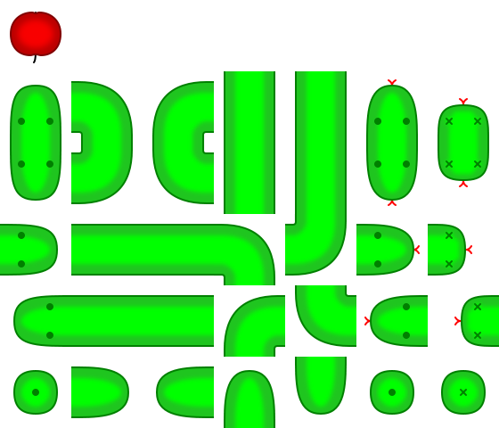

# HAD

A snake game. Study for a beginners' workshop.

Note that this is NOT a workshop.
It's a personal experiment in what would be easy to explain, what needs to be taught, what's OK to leave out.

## Installation

In a Python 3 virtualenv, run:

```console
$ python -m pip install pyglet
```

## Running

For the graphical game, run:

```console
$ python ui.py
```

In the console, run:

```console
$ python textgame.py
```

## Spritesheet

Sprites are [automatically](./make_sprites.py) generated from a [vector file](./sprites.svg):


... into a [spritesheet](./sprites.png):



... and also undividual [tiles](./snake-tiles.zip), which the game uses:


## License

All code and media in this repository are shared under
the [CC0 Public Domain Dedication](https://creativecommons.org/publicdomain/zero/1.0/).
May they serve you well.

Attribution (link to [the repository](https://github.com/encukou/had))
is appreciated but not necessary.
